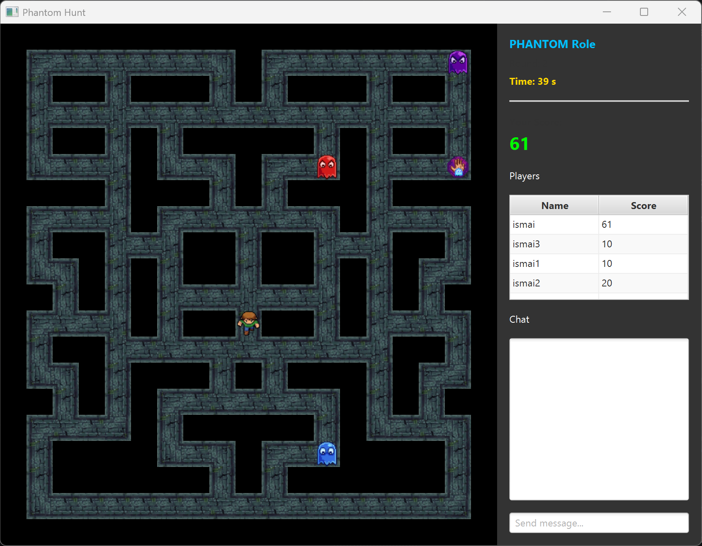

gi# PhantomHunt – Offizielles Spielhandbuch
Willkommen bei PhantomHunt! Du stehst kurz davor, ein verfluchtes Schloss zu betreten. In diesem strategischen 2D-Multiplayer-Spiel ist Teamwork genauso wichtig wie der pure Überlebensinstinkt. Wirst du dem Wahnsinn entkommen oder die Eindringlinge als Geist in die Enge treiben?

## Das Spielprinzip (3 vs. 1)
PhantomHunt ist asymmetrisch. Das bedeutet: Die Teams sind nicht gleich gross und haben völlig unterschiedliche Aufgaben!
Es spielen immer 3 Geister gegen 1 Menschen.

**Der Mensch:**
Wurde im Schloss eingesperrt. Dein Ziel ist es, den Geistern so lange wie möglich auszuweichen. Jede Sekunde des Überlebens ist entscheidend!

**Die Geister:**
Euer Schloss wurde betreten. Eure Aufgabe ist es, als Team zusammenzuarbeiten, den Menschen in die Enge zu treiben und ihn zu erschrecken (zu fangen).

**Runden und Rollentausch**
Ein komplettes Match besteht aus 4 Runden. Nach jeder Runde wechseln die Rollen
automatisch, sodass jeder Spieler einmal der Mensch und dreimal ein Geist ist.

## Installation und Spielstart
Da PhantomHunt ein Multiplayer-Spiel ist, muss ein Spieler den Server hosten und alle Spieler als Clients beitreten.

**Vorbereitung (Für alle Spieler)**
Öffne ein Terminal im Hauptverzeichnis des Spiels (\Gruppe-2).

Kompiliere das Spiel, indem du folgenden Befehl eingibst:
*./gradlew jar*

Nach erfolgreichem Build findest du das fertige Spiel im Ordner build/libs/.

**Ein Spiel hosten (Server)**
Ein Spieler muss die Spielwelt verwalten. Öffne das Terminal und starte den Server mit Angabe eines Ports (z.B. 2222):
Gib diese Zeiele jetzt ein und drücke Enter.
*java -jar build/libs/phantom-hunt.jar server [PORT]*
Teile den anderen Spielern nun deine IP-Adresse und diesen Port mit. Die findest du unter Einstellungen > Netzwerk und Internet.

**Einem Server beitreten (Client)**
Um mitzuspielen, startest du das Spiel im Client-Modus und gibst die IP-Adresse sowie den Port des Servers an:
*java -jar build/libs/phantom-hunt.jar client [IP]:[PORT]*

## Home-Menü und Lobby-System
Sobald du das Spiel über das Terminal gestartet hast, gelangst du in den Home-Screen.

**Dein Profil:**
Als Erstes kannst du dir einen eigenen Spielernamen (Nickname) aussuchen. Dir wird auch standardmässig einer zugeteilt.

**Global Chat & Flüstern:**
Tausche dich im globalen Chat mit allen Spielern auf dem Server aus. Willst du Taktiken geheim besprechen? Dann nutze die "Whisper"-Funktion, um private Nachrichten an einzelne Mitspieler zu senden.

**Wartezeit verkürzen: "Get Wisdom"**
Während du darauf wartest bis alle Spieler dem Server beitreten, kannst du dir die Zeit mit
der Funktion Get Wisdom vertreiben. Ein Klick beschert dir eine kleine,
inspirierende oder kuriose Weisheit.
Bleibst du lange genug auf dem Wisdom-Screen, erhältst du für das nächste Match einen kleinen Bonus:
Nach jeder Runde bekommst du +5 Punkte. Zusätzlich kannst du als Mensch einmal pro Match die
Fähigkeit "Wisdom Blessing" einsetzen.

**Lobby-System:**
Um ein Match zu starten, müssen sich 4 Spieler in einer Lobby sammeln.

**Lobby erstellen:**
Du kannst eine eigene Lobby eröffnen indem du einen Namen auswählst.

**Lobby beitreten:**
Wenn ein Freund bereits eine Lobby erstellt hat, gib einfach den Namen der Lobby ein oder Doppelklicke darauf, um beizutreten.

**Spielstart:**
Sobald sich genügend Spieler (insgesamt 4) in der Lobby eingefunden haben, kann der Host den Start-Button drücken und die erste Runde einläuten.

**Spectator-Modus:**
Wenn eine Lobby bereits voll ist (4/4 Spielern), kannst
du als Spectator (Zuschauer) beitreten und das Geschehen mitverfolgen!

## Steuerung und Anpassung
Damit ihr im Schloss überlebt oder erfolgreich jagt, müsst ihr eure Figur sicher durch die Gänge manövrieren.

**Steuerung (Tastatur & Controller):**
Egal ob du als Mensch oder als Geist spielst, du steuerst deine Spielfigur mit den klassischen Bewegungstasten:

| Aktion | Tastatur | PS-Controller |
| :--- | :--- | :--- |
| **Oben** | W | Linker Stick ↑ / Steuerkreuz ↑ |
| **Links** | A | Linker Stick ← / Steuerkreuz ← |
| **Unten** | S | Linker Stick ↓ / Steuerkreuz ↓ |
| **Rechts** | D | Linker Stick → / Steuerkreuz → |
| **Wisdom Blessing** | Shift+R | ✕ |

**Individuelle Key Bindings:**
Du möchtest nicht mit WASD spielen? Kein Problem! Im Home-Screen kannst
du die Tastenbelegung manuell anpassen und nach deinen Wünschen
konfigurieren.

**Die Jagd (Fangen & Erschrecken):**
Es gibt keine spezielle Taste für einen Angriff. Die Geister fangen den Menschen durch geschicktes Positionieren:

Um den Menschen zu erschrecken, muss ein Geist auf genau dasselbe Feld (die gleiche Position) laufen, auf dem der Mensch gerade steht.

Sobald sich der Mensch und ein Geist auf derselben Stelle befinden, ist der Mensch gefangen! Die aktuelle Runde endet sofort zugunsten der Geister und die Punkte werden verteilt.

## Fähigkeiten:
Jede Runde erscheinen zufällig 2 Fähigkeit auf der Karte. Zusätzlich kann ein Spieler,
der vorher "Get Wisdom" abgeschlossen hat, als Mensch die Wisdom Blessing einsetzen.

**Sichtbare Verwundbarkeit (Glitch-Effekt):** 
Sobald der Mensch dieses Power-Up einsammelt, bleibt die Schwäche der Geister nicht verborgen. Solange der Mensch die Fähigkeit aktiv hat, wird die Form der Geister instabil. Sie flackern hektisch zwischen ihrer normalen Gestalt und einer verzerrten, "geglitchten" Form hin und her.

Wenn der Mensch auf dasselbe Feld wie ein Geist trifft, scheidet der Geist dadurch nicht aus, wird aber magisch an einer andere, weit entfernten Position im Schloss teleportiert und der Mensch erhält 10 Punkt.

**Wisdom Blessing:** 
Wenn der Mensch diese Fähigkeit vorbereitet hat, erscheint nach kurzer Zeit der Hinweis
"Wisdom Blessing ready: Press R". Drückt der Mensch dann R, werden alle Geister für 8 Sekunden
geblendet. Sie sehen in dieser Zeit einen InGame Wosdom Screen mit einem Fortschrittsbalken,
können sich aber weiterhin bewegen und Eingaben machen.

## Punkte und Siegbedingungen
Am Ende der 4 Runden gewinnt nicht das Team, sondern der Einzelspieler mit den meisten Punkten. Punkte sammelst du wie folgt:

**Wenn du als Mensch spielst:**
Du erhältst kontinuierlich 1 Punkt für jede Sekunde, die du überlebst und nicht von den Geistern gefangen wirst.
Schaffst du es, die komplette Rundenzeit zu überleben, erhältst du einen massiven +50 Punkte-Bonus!

**Wenn du als Geist spielst:**
Ihr müsst euch absprechen! Ihr erhaltet je 10 Punkte, wenn ihr den Menschen erfolgreich aufspürt und fangt. Der Fänger erhält zusätzlich noch einen +10 Punkte-Bonus.

Wer am Ende der vierten Runde ganz oben auf dem Scoreboard steht, hat die Partie gewonnen!

